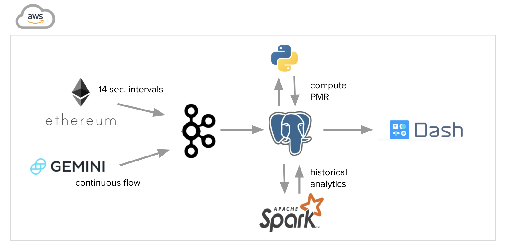
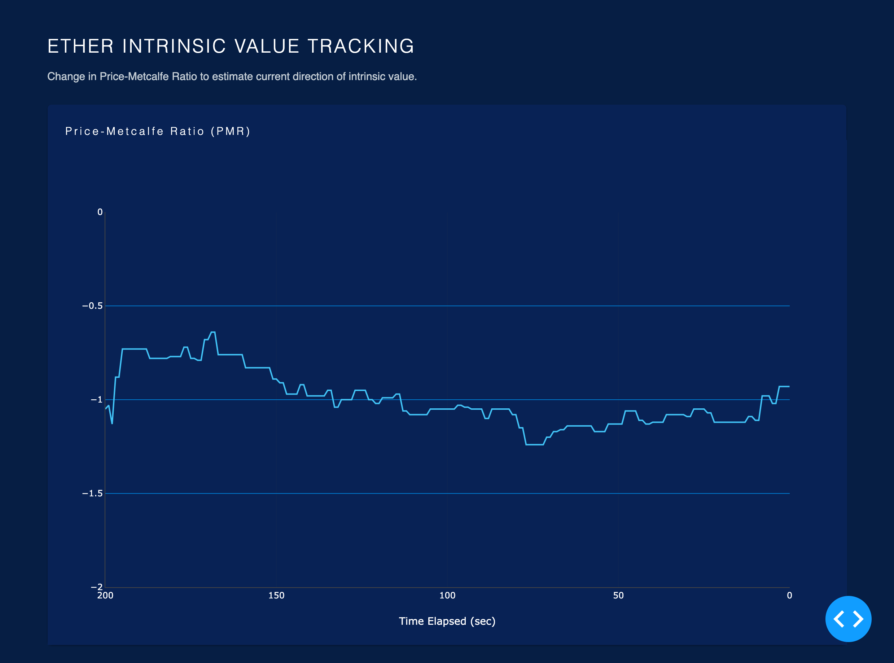

# Intrinsic Ether

### Insight Data Engineering - New York 2020B

## Table of Contents
1. [Introduction](README.md#Introduction)
2. [Data](README.md#Data)
3. [Pipeline](README.md#Pipeline)
4. [Instructions](README.md#Instructions)
6. [Frontend](README.md#Frontend)

## Introduction

The goal of this project is to use Ethereum blockchain data to measure real-time changes in the intrinsic value of network, which can be used to predict Ether prices. The intrinsic value is proxied by computing a Price-to-Metcalfe Ratio (PMR). The relative change in PMR can potentially be used as a leading indicator for cryptocurrency investing and risk management.

#### Price-to-Metcalf Ratio

## Data

### Ethereum Node
Blockchain data was obtained by setting up and syncing an Ethereum Node. Syncing with the network took two days and required the use of a m5a.large EC2 instance with the highest IOPS option. An Ethereum Node on a t2.medium EC2 instance with standard IOPS failed to sync after two weeks.

### Exchange Data
Real-time exchange data was is streamed from the IEX Cloud API for market prices on the Gemini Exchange.

## Pipeline

## Instructions

### Blockchain data extraction

Data from the Ethereum Node relies on the Ethereum ETL python library, which is installed through Python package index using pip. The data is extracted into three separate parts: (1) blocks, (2) transactions, and (3) token_transfers.

Extraction is exectued by running the following commands on the Ethereum Node EC2:
* `ethereumetl stream --provider-uri file://$HOME/.ethereum/geth.ipc -e block > blocks_file.txt`
* `ethereumetl stream --provider-uri file://$HOME/.ethereum/geth.ipc -e transaction > transactions_file.txt`
* `ethereumetl stream --provider-uri file://$HOME/.ethereum/geth.ipc -e token_transfer > token_transfer_file.txt`

### Producers

Four producers are used for each stream of data and executed by running `blocks_producer.py`, `transactions_producer.py`, `token_transfers_producer.py`, and `iex_events_producer.py` on the Ethereum Node EC2. Each producer reads from the Ethereum Node EC2 and loads JSON data into its own topic.

### Consumers

Consumers pull from each Kafka topic and insert data into a Postgres database. Kafka consumers are executed by running `blocks_consumer.py`, `transactions_consumer.py`, `token_transfers_consumer.py`, and `iex_events_consumer.py` on the Postgres EC2 instance.

### Metric

The Price-to-Metcalfe Ratio is computed by running `compute_pmr.py`.

## Frontend

The frontend is a Dash app that continuously pulls data from the Postgres database.

